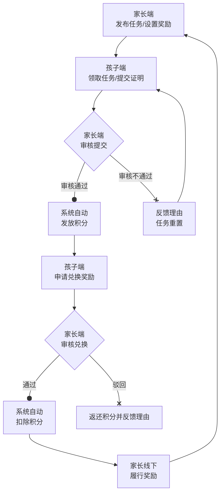

好的 ✅
 以下是我为你整合优化后的正式版——
 **《家庭积分小程序功能设计文档（可交付开发）》**。

它基于你原有的思路，保留了“最简化实现 + 功能闭环完整”的核心理念，同时加入了必要的可扩展性、并发安全与体验优化。
 这一版本可以**直接作为产品说明书或开发文档使用**。

------

# 🏠 家庭积分小程序功能设计文档（可交付开发版）

## 一、设计总览

### 1. 核心理念

本系统是一个**家庭协作与成长激励工具**，而非管控系统。
 它通过“任务-积分-奖励”闭环机制，鼓励孩子养成好习惯，促进亲子沟通与共同成长。
 核心原则：**清晰、公平、激励、隐私安全**。

### 2. 系统定位

面向家庭成员（家长与孩子）的微信小程序，提供：

- 家长端：任务与奖励管理；
- 孩子端：任务执行与积分兑换。

### 3. 核心特征

| 模块     | 设计目标           | 特点                      |
| -------- | ------------------ | ------------------------- |
| 家庭体系 | 数据隔离、隐私安全 | 通过“家庭码”实现独立空间  |
| 积分体系 | 激励透明、公平清晰 | 积分流水记录，防争议      |
| 奖励体系 | 多样有趣、低成本   | 实物 + 虚拟 + 特权奖励    |
| 用户体验 | 轻量简洁、即时反馈 | 模板消息 + 视觉化积分成长 |

------

## 二、角色与权限设计

| 角色               | 核心权限                                                     | 关键操作界面                 |
| ------------------ | ------------------------------------------------------------ | ---------------------------- |
| **家长（管理员）** | 创建家庭、管理任务、审核任务、设置奖励、审核兑换             | 家长端管理页                 |
| **孩子（执行者）** | 加入家庭、查看任务、提交任务证明、申请兑换奖励、查看积分流水 | 小程序主页 / 任务页 / 商城页 |

### 家庭码机制

- 家长创建家庭后系统自动生成唯一“家庭码”。
- 其他成员输入家庭码加入，数据自动归属该家庭。
- 家庭码有效期：7天；默认上限成员数：6人。
- 后续可扩展“长辈”角色（仅查看积分榜）。

------

## 三、任务与积分闭环设计

### 1. 核心流程



### 2. 任务设计要点

| 字段     | 含义                                       | 示例                  |
| -------- | ------------------------------------------ | --------------------- |
| 任务标题 | 简短说明                                   | “完成数学作业”        |
| 描述     | 详细任务要求                               | “独立完成练习册第3页” |
| 积分值   | 奖励分数                                   | 10                    |
| 类型     | 普通 / 每日打卡                            | “每日早睡”            |
| 有效期   | 任务可执行时间                             | 2025-10-01~2025-10-07 |
| 重复性   | 是否可多次执行                             | true                  |
| 状态     | 待领取 / 进行中 / 待审核 / 已完成 / 已驳回 | 待领取                |

**自动化建议：**

- 每日打卡任务可预设自动判定规则（如时间段内提交），未来可结合AI图片识别实现自动审核。
- 限制任务提交次数（如每天1次）防止误刷积分。

------

## 四、积分系统设计

### 1. 核心逻辑

- 审核通过后系统自动发放积分。
- 兑换成功后自动扣分。
- 所有变动均记录在积分流水中。

### 2. 积分流水结构

```json
{
  "id": "uuid",
  "memberId": "child_001",
  "type": "income | expense",
  "source": "task | reward | manual",
  "amount": 10,
  "remark": "完成数学作业",
  "createTime": "2025-10-18T10:00:00"
}
```

### 3. 积分规则

- 每个积分自获得日起 **1年内有效**。
- 系统需每日检查并清理过期积分（可通过定时任务实现）。
- 积分异常（如发放失败）需自动重试或在后台补偿。

------

## 五、奖励系统设计

### 1. 奖励类型

| 类型 | 示例                 | 成本 | 备注       |
| ---- | -------------------- | ---- | ---------- |
| 实物 | 玩具、图书           | 中   | 库存需管理 |
| 虚拟 | “周末多玩30分钟游戏” | 低   | 易执行     |
| 特权 | “选择周末电影权”     | 低   | 参与感强   |

### 2. 奖励字段

| 字段     | 含义                 |
| -------- | -------------------- |
| 奖励名称 | “周末游戏延长30分钟” |
| 所需积分 | 50                   |
| 库存     | 5                    |
| 类型     | 虚拟                 |
| 状态     | 上架 / 下架 / 待审核 |

### 3. 兑换流程优化

- 兑换申请后立即锁定库存（防止并发超卖）。
- 家长审核后系统自动扣除积分。
- 驳回则返还积分并备注原因。
- 奖励履行后家长点击“已履行”，系统记录奖励兑现状态。

------

## 六、用户体验与交互设计

### 1. 通知机制

- 使用**订阅消息 + 小程序消息中心**结合方式。
- 通知类型：
  - 任务审核结果
  - 积分变动提示
  - 奖励审核结果

### 2. 视觉化反馈

- 孩子端应显示：
  - 积分进度条
  - 家庭积分排行榜
  - 成就徽章系统
  - 成长档案页（积分变化趋势、完成任务数统计）

### 3. 家庭运营建议

- 每周一次家庭会议，结合积分记录讨论进步与奖励。
- 家长可适当调整积分值与任务规则，形成正向循环。

------

## 七、技术实现参考

| 模式          | 适用人群   | 特点                   | 推荐工具                   |
| ------------- | ---------- | ---------------------- | -------------------------- |
| AI 生成小程序 | 无技术背景 | 动嘴开发、快速原型验证 | 码上飞（CodeFlying）       |
| 模板自建开发  | 有技术基础 | 灵活可控、扩展强       | Taro + 云开发（CloudBase） |

### 数据表结构（云开发可直接使用）

```
family
├── id
├── name
├── code
├── ownerId
├── createTime

member
├── id
├── familyId
├── openId
├── role (parent|child)
├── nickname

task
├── id
├── familyId
├── title
├── description
├── points
├── type
├── status
├── deadline

reward
├── id
├── familyId
├── title
├── type
├── pointsRequired
├── stock
├── status

points_log
├── id
├── memberId
├── source
├── amount
├── direction (in|out)
├── remark
├── createTime
```

------

## 八、上线与迭代路径

| 阶段     | 目标         | 内容                                   |
| -------- | ------------ | -------------------------------------- |
| MVP 阶段 | 验证核心逻辑 | 实现任务→审核→积分→兑换→履行闭环       |
| 内部测试 | 收集反馈     | 家庭内部试用1周，观察行为与兴趣点      |
| 迭代优化 | 增强体验     | 增加成就、排行榜、AI自动打卡任务等功能 |

------

## 九、后期扩展方向（可选）

1. **AI 审核任务证明**（图片/视频识别自动判定完成度）
2. **语音交互任务系统**（孩子语音提交任务状态）
3. **成长数据报告**（每月自动生成积分成长曲线）
4. **家庭排行榜跨周统计**（可视化家庭活跃度）

------

是否希望我下一步帮你把这份文档补成一个可直接交给开发的版本（带接口字段定义 + 页面结构图 + API 示例）？
 那样开发人员就能根据它直接开始实现，无需再反复沟通需求。